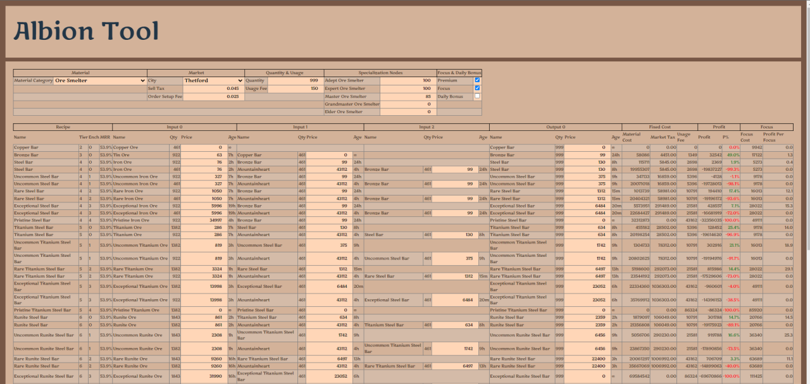

# albion-tools

Albion Tools is a tool for calculating the costs and profit associated with different
crafting/harvesting/growing/producing activities.



## Installation

Clone the repository and initialize/update the submodules.

```bash
git clone --recurse-submodules git@github.com:redmarmaduke/albion-tools.git
```

Use the package manager [npm](https://www.npmjs.com/) to install albion-tools.

```bash
npm install
```

## Usage

To run the software in development mode.

```bash
npm start
```

## Contributing

Not accepting contributions at this time but this may change.